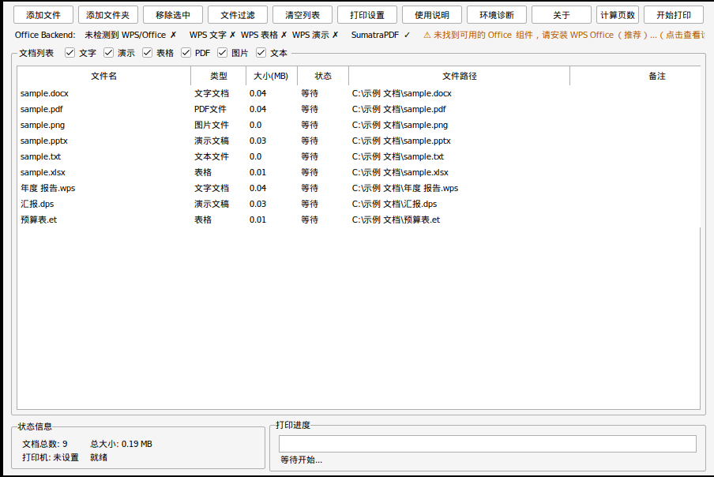

# Batch Document Printer – WPS Edition

> 办公文档批量打印器 · WPS 版 · v1.0.0
>
> Windows + WPS Office 批量打印工具：**只安装 WPS Office、不安装 Microsoft Office**，也能把
> 文字、表格、演示、PDF、图片、文本一次性批量打印出去。

- 下载：[Releases 页面](https://github.com/lsl9119/batch-document-printer/releases)（`BatchDocumentPrinter-WPS-v1.0.0.zip`，解压即用，无需安装 Python）
- 许可证：MIT（保留原项目作者信息，见 [LICENSE](LICENSE) / [NOTICE](NOTICE)）
- 基于 [icescat/batch-document-printer](https://github.com/icescat/batch-document-printer)（作者：喵言喵语）二次开发

---

## 软件介绍

原项目通过 `Word.Application` / `xlwings` / `PowerPoint.Application` 调用 Microsoft Office，
在只装了 WPS 的电脑上 Office 文档无法打印。WPS 版把 **WPS Office 作为一等公民**：

- 新增统一的 Office Backend 层（`src/backends/`），通过 WPS 的 COM 接口直接控制
  WPS 文字 `KWPS.Application`、WPS 表格 `KET.Application`、WPS 演示 `KWPP.Application`
- 表格不再依赖 xlwings（它只支持 Microsoft Excel），直接通过 `KET.Application` 打印整个工作簿
- WPS 演示 `PrintOptions.ActivePrinter` 不可写时，临时切换 Windows 默认打印机，
  `finally` 中恢复，程序崩溃后下次启动也会自动恢复
- 批量稳定性：WPS 实例复用、单文件失败不中断队列、卡死超时自动结束**本程序启动的** WPS 进程、
  批次结束清理进程、详细打印日志
- 未安装 WPS 时可自动回退到 Microsoft Office（可在设置中限定“仅 WPS”）

## 截图



> 说明：截图由打包后的 `BatchDocumentPrinter-WPS.exe` 在 Linux + Wine 环境中渲染（开发环境没有 Windows 桌面），
> 因此显示“未检测到 WPS”。在 Windows 上界面为系统原生风格，检测到 WPS 时状态栏显示
> `Office Backend: WPS Office ✓  WPS 文字 ✓  WPS 表格 ✓  WPS 演示 ✓`。

## 支持格式

| 类型 | 扩展名 | 打印引擎 | 需要 WPS/Office |
|------|--------|----------|-----------------|
| PDF | `.pdf` | 内置 SumatraPDF | 否 |
| 文字 | `.doc` `.docx` `.wps` | WPS 文字 `KWPS.Application` | 是（WPS 优先） |
| 表格 | `.xls` `.xlsx` `.et` | WPS 表格 `KET.Application` | 是（WPS 优先） |
| 演示 | `.ppt` `.pptx` `.dps` | WPS 演示 `KWPP.Application` | 是（WPS 优先） |
| 图片 | `.jpg` `.jpeg` `.png` `.bmp` `.tiff` `.tif` `.webp` | SumatraPDF（备用：Windows GDI） | 否 |
| 文本 | `.txt`（UTF-8 / GBK / UTF-16 自动识别） | Windows GDI 直接打印（备用：记事本） | 否 |

## 系统要求

- Windows 10 / Windows 11（64 位）
- WPS Office（个人版 / 专业版，需要 COM 接口可用，见下文“WPS COM 诊断”）
- **Microsoft Office 非必需**（未安装 WPS 时可作为备用引擎）
- 打印 PDF、图片、文本不需要 WPS 或 Office
- 普通用户权限即可运行，无需安装 Python / pip / Git / Visual Studio

## 安装

1. 从 Releases 下载 `BatchDocumentPrinter-WPS-v1.0.0.zip`，并用 `SHA256SUMS.txt` 校验（可选）：
   `certutil -hashfile BatchDocumentPrinter-WPS-v1.0.0.zip SHA256`
2. 解压到任意目录（建议不要放在 `C:\Program Files`，以便程序在自身目录保存配置和日志）
3. 双击 `BatchDocumentPrinter-WPS.exe`

程序目录结构：

```text
BatchDocumentPrinter-WPS\
├── BatchDocumentPrinter-WPS.exe   主程序（图形界面）
├── BDP-WPS-Diagnose.exe           WPS COM 诊断工具（控制台，不打印）
├── _internal\                     运行库、SumatraPDF、图标
├── data\  logs\                   首次运行后生成（配置 / 日志）
├── README.md  LICENSE  NOTICE  RELEASE_NOTES.md
└── licenses\                      第三方许可证（SumatraPDF GPLv3 等）
```

若程序目录不可写，配置和日志会保存到 `%LOCALAPPDATA%\BatchDocumentPrinter-WPS\`。

## 使用说明

```text
拖入文件/文件夹（或拖到 exe 图标上）
  → 自动识别类型、加入打印队列
  → 打印设置：打印机 / 份数 / 纸张 / 单双面 / 方向 / 彩色黑白
  → 开始打印（批量连续打印）
  → 列表实时显示 等待 / 正在打印 / 成功 / 失败（失败原因见“备注”列）
  → 完成后提示“成功 N，失败 M”，并写入打印日志
```

- 右键菜单：仅打印选中文档、计算选中文档页数、打开所在文件夹等
- 打印过程中“开始打印”按钮变为“停止打印”：当前文件完成后停止，其余标记为“已取消”
- 顶部状态栏显示 Office Backend 与 WPS 各组件状态，点击警告或“环境诊断”查看详情

### 打印参数

| 参数 | 选项 | 说明 |
|------|------|------|
| 打印机 | 枚举 Windows 已安装打印机 | |
| 份数 | 1–999 | 由 WPS `PrintOut(Copies=…)` / SumatraPDF `Nx` / GDI 控制 |
| 纸张 | A3 / A4 / A5 / B5 / Letter / Legal（可“同步电脑纸张”） | |
| 方向 | 自动 / 纵向 / 横向 | |
| 单双面 | 单面 / 双面-长边翻转 / 双面-短边翻转 | |
| 色彩 | 彩色 / 黑白 | |
| Office 引擎 | 自动（优先 WPS）/ 仅 WPS / 仅 Microsoft Office | |

参数如何生效：

- **PDF / 图片**：全部参数通过 SumatraPDF `-print-to` + `-print-settings` 传递
- **文字 / 表格 / 演示**：
  - 纸张、方向默认**遵循文档自身的页面设置**（表格的 A3 横向表、A4 纵向表会各自正确打印）；
    勾选“Office 文档也强制使用以上纸张和方向”后，会在打印前临时修改页面设置（不保存原文件）
  - 单双面、色彩：批次开始时写入该打印机的**每用户默认打印参数**（`PRINTER_INFO_9`，不需要管理员权限，
    不影响其他用户），批次结束后恢复；WPS 演示另外设置 `PrintOptions.PrintColorType`
  - 目标打印机：先尝试 `ActivePrinter`，并在批次包含 Office 文档且目标打印机不是默认打印机时，
    **临时把目标打印机设为 Windows 默认打印机**，结束后恢复（见下文“默认打印机保护”）
- 打印机驱动不支持的设置（例如黑白打印机选了彩色、不支持双面）不会导致失败，
  日志与完成提示中会记录：`当前打印机驱动不支持该设置，已使用驱动默认值`

### WPS 与 Microsoft Office 兼容

同一个程序同时支持 WPS Office 和 Microsoft Office，按组件（文字 / 表格 / 演示）分别选择引擎：

| 电脑上安装了 | “自动”模式（默认）实际使用 |
|--------------|---------------------------|
| 只有 WPS Office | WPS 文字 / WPS 表格 / WPS 演示 |
| 只有 Microsoft Office | Word / Excel / PowerPoint |
| 两者都有 | 优先 WPS；可在“打印设置 → Office 引擎”改为“仅 Microsoft Office” |
| WPS 某个组件 COM 异常（如表格） | 该组件自动改用 Microsoft Office（若已安装），其余仍用 WPS |
| 都没有 | Office 文档打印失败并提示安装；PDF / 图片 / 文本照常打印 |

两种引擎使用同一套打印流程（参数、超时保护、进程清理、默认打印机恢复）。

### 默认打印机保护

WPS 演示的 `PrintOptions.ActivePrinter` 在部分版本中是只读的，因此需要临时切换系统默认打印机：

1. 切换前把“原默认打印机 / 原打印参数”写入 `data\printer_restore_state.json`
2. 批次结束（成功、失败、取消、异常）时在 `finally` 中恢复，并删除状态文件
3. 程序被强制结束或崩溃时，下次启动会读取状态文件自动恢复
4. 同一时间只允许一个批次修改打印机环境（进程内锁 + 状态文件中的进程号）

> 批量打印期间请勿手动修改默认打印机；Windows 10/11 的“让 Windows 管理默认打印机”选项也可能在打印后改变默认打印机，
> 建议关闭（设置 → 蓝牙和其他设备 → 打印机和扫描仪）。

## WPS COM 诊断

程序通过 COM 注册信息（ProgID → CLSID → LocalServer32）检测 WPS，而不是只看安装目录。
如果某个组件不可用，状态栏和日志会明确提示，例如：

```text
检测到 WPS Office，但WPS 表格 COM 接口不可用。ProgID: KET.Application
```

诊断步骤：

1. 主界面点击 **环境诊断 → 深度检测**，或在程序目录运行 `BDP-WPS-Diagnose.exe`，应输出：
   ```text
   WPS Writer COM: OK
   WPS Spreadsheet COM: OK
   WPS Presentation COM: OK
   ```
2. 若提示 ProgID 未注册 / LocalServer32 指向的程序不存在：
   - 打开 **WPS Office 配置工具**（开始菜单 → WPS Office → 配置工具，或运行 WPS 安装目录下的 `ksomisc.exe`）
     → **高级** → **兼容设置** → 勾选 **“WPS Office 兼容第三方系统和软件”** → 确定，然后重新检测
   - 在配置工具中使用“开始修复”，或重新安装 WPS Office
   - 部分精简版 / 绿色版 WPS 没有注册 COM 组件，需要使用官方完整安装包
3. 若注册正常但启动失败 / 超时：
   - 先手动打开一次 WPS，完成首次启动的协议确认、登录提示等弹窗
   - 确认本程序与 WPS 以相同权限运行（不要一个“以管理员身份运行”另一个不是）
   - 关闭所有 WPS 窗口后重试（任务管理器中没有 `wps.exe` / `et.exe` / `wpp.exe`）
4. 开发者也可以运行 `python scripts\test_wps_com.py`（与 `BDP-WPS-Diagnose.exe` 相同）

## 日志

```text
logs\
├── app.log                运行日志（滚动 5MB × 5）：环境检测、COM 调用、异常堆栈
└── print_YYYYMMDD.log     打印任务日志：每个任务一行
```

每个任务记录：时间、成功/失败、耗时、文件类型、Backend（例如 `WPS Office (KET.Application)`）、
打印机、纸张、单双面、方向、份数、色彩、文件路径、错误信息、调用方式备注。

## 稳定性设计

| 问题 | 处理方式 |
|------|----------|
| COM 生命周期 | 每个组件一个 WPS 实例，批次内复用（每 30 个文件回收一次）；批次结束 `Quit`，15 秒未退出则强制结束 |
| 进程残留 | 通过“创建前后进程快照差集”识别本程序启动的 `wps.exe/et.exe/wpp.exe`，只结束这些进程，不影响用户自己打开的 WPS |
| 单个文件失败 | 异常只影响当前文件；WPS 崩溃（RPC 服务器不可用）时自动重启该组件，继续下一个文件 |
| 卡死 | 看门狗超时（文字 3 分钟、表格/演示 5 分钟、PDF/图片按文件大小 2–15 分钟），超时结束 WPS 进程，使阻塞的 COM 调用返回 |
| 弹窗 | `Visible=False`、`DisplayAlerts` 关闭、宏自动运行禁用；加密文档用“假密码”打开，直接报错而不是弹出密码框 |
| 文件被 WPS 打开 / 网络共享 / 超长路径 | 复制到短路径临时目录后打印，结束后删除；只读文件以只读方式打开 |
| 中文路径 / 空格 | 全程使用 Unicode 路径（COM、SumatraPDF 参数列表均不经过 shell） |
| 线程安全 | 打印在独立工作线程中执行，界面更新通过队列回到主线程；同一时间只允许一个批次 |

## Known Issues（已知问题）

- **真实 WPS 环境验证**：v1.0.0 的 WPS COM 调用逻辑已通过 mock 测试和冒烟打包测试，但**尚未在 Windows 10/11 + WPS 的真实环境中完成人工验证**
  （开发环境没有 Windows/WPS，详见 [验证记录](docs/VERIFICATION.md)）。首次使用建议先用
  `BDP-WPS-Diagnose.exe` 检查 COM，并用“Microsoft Print to PDF”试打几个文件
- WPS 文字文档的纸张/方向以文档自身页面设置为准（与 Word 行为一致）；强制套用会导致重新排版
- 双面、彩色依赖打印机驱动读取“每用户默认打印参数”，个别驱动或 WPS 版本可能忽略，此时使用驱动默认值
- 若启动批量打印时 WPS 已在运行，WPS 可能复用该实例：程序不会关闭它，但此时超时保护无法强制结束进程，
  因此开始打印前会提示关闭 WPS
- 打印较大的临时副本（网络路径 / 被占用文件）时，文档中带路径的域（如 `FILENAME \p`）会显示临时路径
- “Microsoft Print to PDF”默认会弹出“另存为”对话框；自动化测试请使用 `scripts\setup_test_pdf_printer.ps1` 创建的文件端口打印机
- 使用未签名的 PyInstaller 可执行文件，个别杀毒软件可能误报

## 开发

```bash
pip install -r requirements-dev.txt
python -m pytest -q tests              # 单元测试 + mock 端到端测试（不接触真实打印机）
python scripts/make_samples.py         # 重新生成 tests/samples
python main.py                         # 运行
python build_exe.py                    # 测试 + PyInstaller(onedir) + zip + SHA256SUMS（需在 Windows 上）
```

真实环境验证（Windows + WPS，不消耗纸张）：

```powershell
# 管理员 PowerShell：创建文件端口虚拟 PDF 打印机 "BDP Test PDF"
powershell -ExecutionPolicy Bypass -File scripts\setup_test_pdf_printer.ps1 -OutputFile C:\bdp_test\out.pdf
python scripts\test_wps_com.py                                   # COM 冒烟测试
python scripts\e2e_real_print.py --printer "BDP Test PDF" --port-file C:\bdp_test\out.pdf --native
```

`e2e_real_print.py` 会打印全部样例（含一个故意损坏的 docx，以及用 WPS 另存生成的 .wps/.et/.dps），
检查每个输出 PDF 的页数与方向、WPS 进程是否退出、默认打印机是否恢复，结果写入 `e2e_output/report.json`。
它拒绝向名称中不含 PDF/XPS 的打印机发送作业，避免误用物理打印机。

GitHub Actions：`ci.yml`（Windows/Linux 单元测试 + Windows 打包）、`release.yml`（打 tag 自动构建并发布）、
`wps-e2e.yml`（手动触发：在 Windows runner 上安装 WPS 并运行真实 COM/打印测试，仅供参考）。

### 项目结构

```text
main.py                         入口：日志、崩溃后恢复默认打印机、清理临时文件
src/version.py                  产品名称与版本
src/backends/                   Office Backend 层（WPS 优先）
  office_backend.py             OfficeKind / OfficeBackend / OfficeSession / 会话池 / 看门狗 / detect_backend()
  wps_backend.py                KWPS / KET / KWPP
  ms_office_backend.py          Word / Excel / PowerPoint（可选回退）
  office_ops.py                 打开/打印/页数/关闭（多级降级调用兼容 WPS）
  com_utils.py  process_utils.py
src/core/
  print_controller.py           批量打印队列、超时、日志
  printer_environment.py        默认打印机切换与恢复、每用户打印参数、崩溃恢复
  environment.py                启动环境检测
  file_prep.py                  占用/网络/长路径文件的临时副本
src/handlers/                   各格式处理器（文字/表格/演示/PDF/图片/文本）
src/gui/                        tkinter 界面（延续原项目风格）
scripts/                        COM 冒烟测试、真实打印 E2E、样例生成、测试打印机
tests/                          pytest（全部 mock）
```

## 致谢与许可

- 原项目：[batch-document-printer](https://github.com/icescat/batch-document-printer)，作者 **喵言喵语 (icescat)**，MIT 许可
- WPS COM 调用方式参考：[harness-anything](https://github.com/yb2460/harness-anything) 的 WPS Backend（MIT 许可，未包含其框架代码）
- PDF/图片打印：[SumatraPDF](https://github.com/sumatrapdfreader/sumatrapdf) 3.4.6（GPLv3，作为独立程序随附，许可证见 `licenses/`）
- 本项目采用 MIT 许可证，详见 [LICENSE](LICENSE) 与 [NOTICE](NOTICE)

WPS Office 是金山办公的商标，Microsoft Office 是微软公司的商标，本项目与二者无关联。
